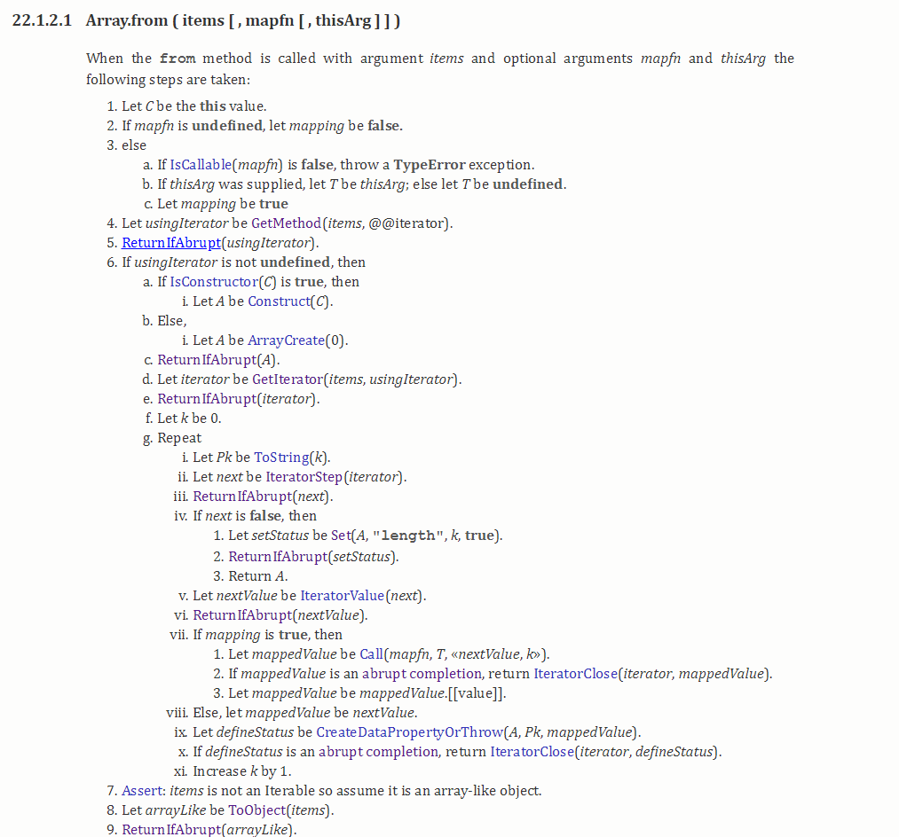
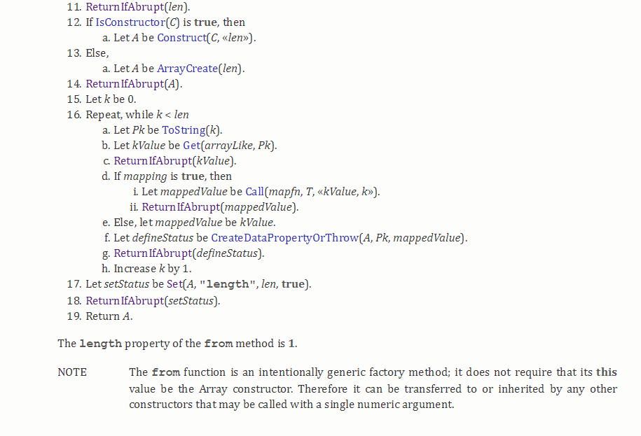
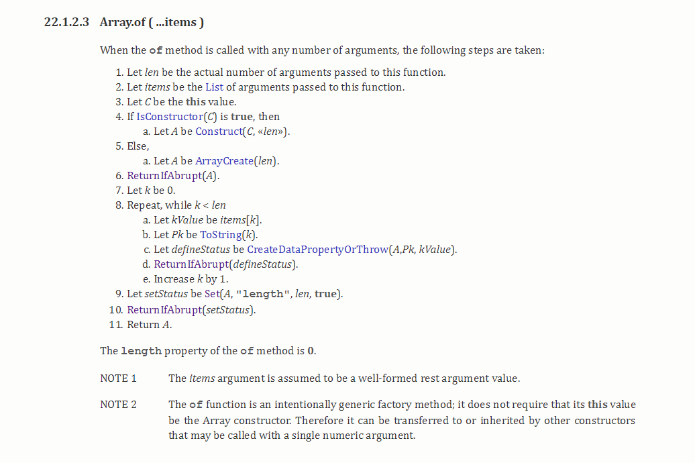

###你真的懂Array吗？


####前记

今天无意中发现维护的代码中有这样一段

```
function repeatArray(number){
    return new Array(number) 
}
 repeatArray(2)   //[empty × 2]
 repeatArray(undefined)   //[ undefined ]
 repeatArray()   //[ undefined ]
```
很显然这段代码是想获取一个指定长度的空数组,但是如果函数不传参数或者传入的参数
是undefined,则返回的是一个长度为1，内容为undefined的数组。大部分的第一反应
就是给函数number设置缺省值为0不就搞定了吗，确实如此。
但是这么个问题却让我不禁反问自己，

1. new Array()的内部执行机制到底是什么？
2. new Array()和 Array() 的区别到底是什么？
3. 有没有更加好，直观的解决方案？

#### 正所谓遇事不决去查规范，于是去查 ECMASciprt 的 [spec](!http://www.ecma-international.org/ecma-262/6.0/#sec-array-constructor)


这段翻译过来大致是, new Array() 通过构造函数的形式创建初始化了一个 **Array object**,
而 Array() 则是通过调用function 的形式返回一个 **Array object** ，所以二者的行为是相等的，
然后又说 Array 构造器设计的主要目的是方便继承.

####接下来我们继续看 Array(len) 内部具体的执行机制是怎样的？

 
 

Array() 无参数的时候可以看出最后一步是直接调用 ArrayCreate(0,proto) 返回的是一个长度为0的 Array object

 

Array(len) 参数的个数等于1的时候，我们看到先对 Type(len) 判断len的类型。
1. len 如果不是数字，则返回一个长度为 1 ，并添加一个 key 为 '0',value 为 len 属性的 Array object
2. len 是数组的话，会对len 大小进行检查，最后返回一个长度为 len 的空 Array object，并设置 { length : len }

```
    Array() // []
    Array(1) // [<1 empty item>]
    Array(undefined) // [undefined]
    Array(null) // [null]
    Array(true) // [true]
    Array(0) // []
```

 
Array(...items) 参数的个数 >=2 的时候，我们看到新建一个 numberOfArgs （items的长度） 长度的空数组，
并把items的对应索引的值设置到 返回的 Array Object中,同时设置 { length : numberOfArgs }

#### 至此我们已经清楚了new Array() 和 Array() 对不同参数的处理机制，接下来我们看下ES6新增的
Array.from() 和 Array.of() 的执行机制

#### Array.from ( items [ , mapfn [ , thisArg ] ] )

Array.from 的处理机制比较复杂，主要分两部分


1. items 可迭代（Iterable）的对象【即存在@@iterator方法，例如Map,Set,Array,
Iterator Object(即调用 ES6 Generator 函数的返回结果)】
```
    Array.from(new Set([1,2,3])) // [1,2,3]
    Array.from('hello') // [ 'h', 'e', 'l', 'l', 'o' ]//这里对字符串做了ToObject()操作
    Array.from([1, 2, 3]) //[1,2,3]
    Array.from((function *(){yield 1;yield 2;yield 3})()) //[1,2,3]
```
2. items 是类数组对象（array-like）对象，（例如函数内部的arguments对象,DOM中的 NodeList 对象）
本质特征只有一点，即必须有length属性
```
    Array.from({length:3,0:'test'}) //['test',undefined,undefined]
    function foo() {
      let args = Array.from(arguments);
    }
```

**注意** Array.from()还支持传入第二个参数 mapfn 类似与数组的map方法，
第三个参数 thisArg 可以用来指定 mapfn 的 this ,
用来对每个元素进行处理，将处理后的值放入返回的数组。

```
    Array.from({ length: 2,0:'aaa',1:'bbb' }, (item,index) => ({item,index})) 
     //[ { item: 'aaa', index: 0 }, { item: 'bbb', index: 1 } ]
```

#### Array.of ( ...items )



Array.of(...items) 主要用于将传入的参数，转换为数组，不会像 Array() 那样因为参数个数行为不一致
等于与

```
function ArrayOf(){
  return [].slice.call(arguments);
}
```
**注意** 最后的note2,指出我们可以自定 Array.of()的 this 值，实现一些特殊的继承效果,比如下面这个例子 
Person 变成了一个 array-like 的对象

```
function Person(len){
    this.personLen = len;
}

let func = Array.of.bind(Person)
let person = func(1,2,3)   // Person { '0': 1, '1': 2, '2': 3, personLen: 3, length: 3 }
person instanceof Person  //true
person instanceof Array   //false
    
```

#### 总结，通过阅读规范，我们了解到Array的一些内部执行机制，（虽然对我们写业务代码没什么帮助）
不过我们让知道了代码中可能存在的一些隐患，不过忍不住吐槽js这种方法的重载

对上面的有缺陷的代码，也可以用如下方法(语义更加清晰)

```
function repeatArray2(length = 0){
    return Array.from({length})
}
 repeatArray(2)   //[ undefined, undefined ] //注意这里与new Array(2)的结果是不一样的
 repeatArray(undefined)   //[  ]
 repeatArray()   //[  ]
```

