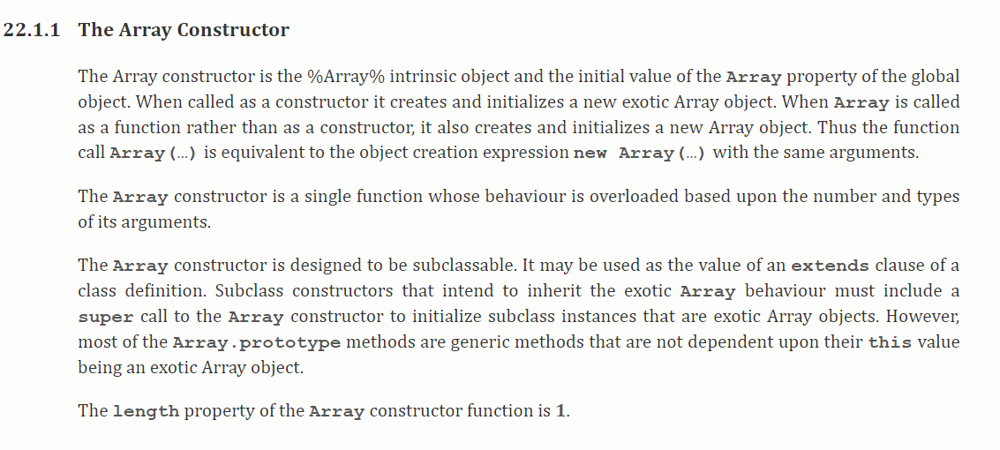
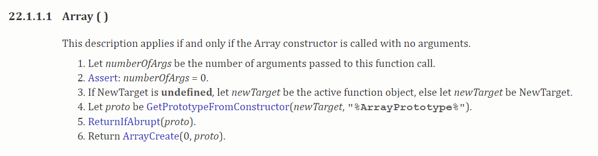
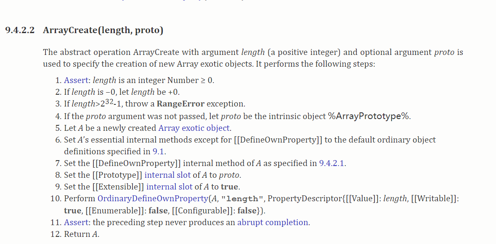
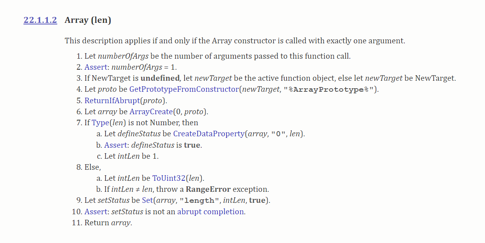
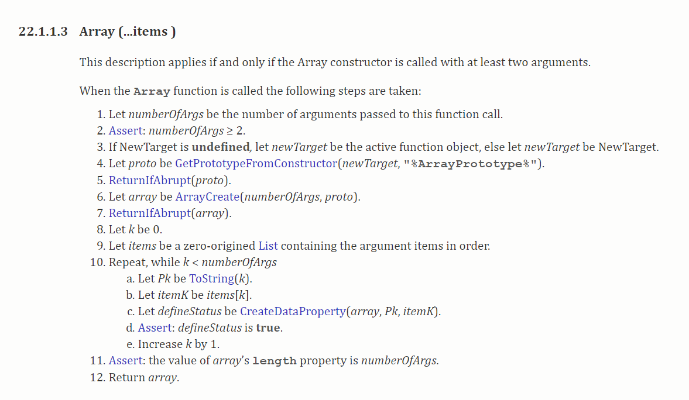

###你真的懂Array吗？


####前记

今天无意中发现维护的代码中有这样一段

```
function repeatArray(number){
    return new Array(number) 
}
 repeatArray(2)   //[empty × 2]
 repeatArray(undefined)   //[ undefined ]
 repeatArray()   //[ undefined ]
```
很显然这段代码是想获取一个指定长度的空数组,但是如果函数不传参数或者传入的参数
是undefined,则返回的是一个长度为1，内容为undefined的数组。大部分的第一反应
就是给函数number设置缺省值为0不就搞定了吗，确实如此。
但是这么个问题却让我不禁反问自己，

1. new Array()的内部执行机制到底是什么？
2. new Array()和 Array() 的区别到底是什么？
3. 有没有更加好，直观的解决方案？

#### 正所谓遇事不决去查规范，于是去查 ECMASciprt 的 [spec](!http://www.ecma-international.org/ecma-262/6.0/#sec-array-constructor)



这段翻译过来大致是, new Array() 通过构造函数的形式创建初始化了一个 **Array object**,
而 Array() 则是通过调用function 的形式返回一个 **Array object** ，所以二者的行为是相等的，
然后又说 Array 构造器设计的主要目的是方便继承.

####接下来我们继续看 Array(len) 内部具体的执行机制是怎样的？




Array() 无参数的时候可以看出最后一步是直接调用 ArrayCreate(0,proto) 返回的是一个长度为0的 Array object



Array(len) 参数的个数等于1的时候，我们看到先对 Type(len) 判断len的类型。
1. len 如果不是数字，则返回一个长度为 1 ，并添加一个 key 为 '0',value 为 len 属性的 Array object
2. len 是数组的话，会对len 大小进行检查，最后返回一个长度为 len 的空 Array object，并设置 { length : len}


Array(...items) 参数的个数 >=2 的时候，我们看到新建一个 numberOfArgs （items的长度） 长度的空数组，
并把items的对应索引的值设置为返回的 Array Object中,同时设置 { length : numberOfArgs }


